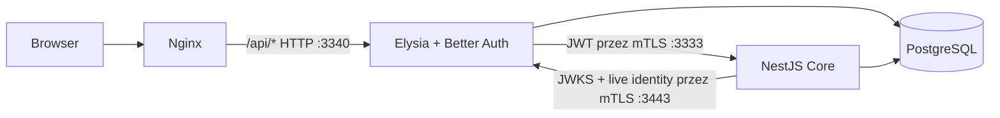

# Faza 5 — auth i gateway

## Zakres 5.1–5.5

1. Discovery i przypięcie Elysia `2.0.0-beta.16`, Better Auth oraz PassKeys `1.7.5`.
2. Osobny proces `auth-service` z Elysia i publiczną bramą HTTP.
3. Przeniesienie rejestracji organizacji, sesji i CSRF; migracja `0003_auth_jwks`.
4. JWT/JWKS, świeże uprawnienia, mTLS i przełączenie Nginx.
5. Usunięcie auth z Express, testy migracji, PassKey, restartu i bezpieczeństwa.

Auth i Core korzystają z tego samego obrazu workspace backendu, ale mają osobne
entrypointy i procesy. `src/auth/instance.ts` jest jedynym właścicielem instancji
Better Auth. Core i jego adaptery nie importują Better Auth ani kluczy podpisujących.
Core/worker mają wyzerowane `BETTER_AUTH_SECRET` i `CSRF_SECRET` w Compose.
Baza pozostaje wspólna; ta faza nie wprowadza osobnych ról PostgreSQL dla usług.
Klucz prywatny JWT w bazie jest szyfrowany sekretem dostępnym procesowi auth.

## Topologia i konfiguracja

Publiczny `BETTER_AUTH_URL`, `FRONTEND_URL`, trusted origins i RP ID pozostają
bez zmian. `AUTH_ISSUER=https://auth-service:3443/api/auth` jest kanonicznym
wewnętrznym issuerem. Gateway używa stałego `CORE_ORIGIN=https://backend:3333`.
Nie publikujemy portów Core, auth RPC ani publicznego listenera auth na hoście;
dostęp przeglądarki prowadzi przez Nginx i dotychczasowy origin.

`AUTH_GATEWAY_RATE_LIMIT` to limit żądań/IP/minutę, domyślnie 300; mapa ma
maksymalnie 10 000 wpisów. Better Auth zachowuje własny limiter, Core swój.
Nginx nadpisuje X-Real-IP/X-Forwarded-For; auth nie może być wystawiony z pominięciem
tego proxy. Fixture E2E zwiększa wyłącznie limit gateway do 10 000, bo tworzy wiele
kont i sesji z jednego IP. Test jednostkowy osobno sprawdza odrzucenie burstu.

Bun 1.4.2 nie obsługuje `getPeerCertificate()` na socketach serwera HTTPS
([ograniczenie runtime](https://bun.sh/docs/runtime/nodejs-compat)). Dlatego
oba kierunki mTLS ufają wyłącznie przypiętemu certyfikatowi drugiej usługi.
Generator tworzy oddzielne samopodpisane tożsamości w `identity/backend` i
`identity/auth-service`, a katalog `identity/trust` zawiera tylko publiczne
certyfikaty. Certyfikaty bazy, LLM i brokera nie są akceptowane przez tę granicę.
Każdy proces montuje tylko własny klucz identity i publiczny certyfikat peera.
Healthcheck Core działa na loopback `127.0.0.1:3335`, bez dostępu do API.

## Upgrade i rollback

1. Wykonaj backup bazy i zachowaj dotychczasowy `BETTER_AUTH_SECRET`, `CSRF_SECRET`,
   cookie policy, publiczny origin i RP ID. Nie generuj nowych sekretów sesji.
2. Dostarcz certyfikaty identity i przypisane im wolumeny. Prywatne pliki mają
   uprawnienia `0600` i muszą być czytelne dla UID 1000 (użytkownik Bun obrazu);
   trust bundle zawiera wyłącznie certyfikaty publiczne. Generator certyfikatów
   dev jest przeznaczony dla nowego/izolowanego stosu; nie uruchamiaj go nad
   działającym katalogiem certyfikatów, bo obraca również certyfikaty innych usług.
3. Wykonaj `bun run db:migrate:plan`, następnie `bun run db:migrate:apply` z
   połączeniem migratora. `0003` wyłącznie dodaje tabelę JWKS; nie zmienia kont,
   haseł, sesji, organizacji, ról, credential ID, kluczy ani liczników WebAuthn.
4. Uruchom auth i Core, sprawdź health, następnie przełącz Nginx na nowy gateway.
   Auth odmawia startu bez magazynu JWKS. Migracje nie uruchamiają się automatycznie.
5. Sprawdź login, zmianę organizacji, PassKey, zapis incydentu i logout.

Rollback: zatrzymaj ruch na czas zmiany i przywróć razem obrazy oraz konfigurację
Compose/Nginx z końca fazy 4. Zwróć sekret sesji do starego procesu backendu.
Nie cofaj danych ani nie usuwaj `jwks`: stary kod ignoruje addytywną tabelę.
Sesje i PassKeys pozostają kompatybilne przy zachowaniu sekretu, originu i RP ID.
Klucze JWT należy zachować na potrzeby ponownego wdrożenia fazy 5.

## Rotacja i awarie

Plugin obraca klucze Ed25519 co 24 h, z 300 s overlap. JWT żyje do 60 s,
cache JWKS do 30 s, cooldown odświeżenia wynosi 5 s. Leniwa rotacja może dać
krótką odmowę dla nowego `kid` podczas cooldownu. Przy planowanej rotacji wykonaj
emisję kontrolną po stronie auth, a następnie zrestartuj Core, aby wyczyścić cache,
przed otwarciem ruchu. Nie ma publicznego endpointu wymuszania rotacji.

Przy kompromitacji klucza wstrzymaj ruch, usuń/unieważnij dotknięte sesje i klucz,
wygeneruj nowy klucz przez server-only API auth, zrestartuj auth/Core i sprawdź
odrzucenie starego tokenu przed wznowieniem ruchu. Samo usunięcie klucza z bazy
nie czyści już pobranych kopii JWKS. Nie zmieniaj sekretu szyfrującego Better Auth
bez zaplanowanej migracji szyfrowania i sesji.

Rotacja mTLS: najpierw zainstaluj u peera bundle starego i nowego publicznego
certyfikatu, zrestartuj proces odbiorcy, podmień własny certyfikat/klucz nadawcy
i zrestartuj go. Po potwierdzeniu połączeń usuń stary certyfikat z trust bundle.
Pliki konfigurowane przez `IDENTITY_TLS_PEER_CERT_PATH`, `IDENTITY_TLS_CERT_PATH`
i `IDENTITY_TLS_KEY_PATH` są odczytywane przy starcie; nigdy z żądania HTTP.

Awaria auth/JWKS nie uruchamia fallbacku do cookie w Core. Zwracamy odmowę albo
503 zgodnie z [kontraktem tożsamości](identity-contract.md). Logi, trace i publiczne
odpowiedzi nie zawierają tokenu Core, cookies ani prywatnych kluczy.

## Weryfikacja

- `bun run check` i `bun test backend/src`: statyka, profil JWT, cache, awarie,
  sesje Better Auth przez Elysia, CSRF granica i rate limiting.
- `bun run test:core:db`: pełna migracja 1.0.3 z zachowaniem rekordów auth oraz
  regresja transakcji, idempotencji, outbox i tenant isolation.
- `bun run test:e2e:all`: Chromium/Firefox/WebKit; rejestracja, reset hasła,
  organizacje, role, incydenty; Chromium dodatkowo rzeczywisty WebAuthn z wirtualnym
  authenticatorem. Pozostałe przeglądarki pomijają wyłącznie scenariusz CDP.
- Fixture `phase5-probe.ts`: prawdziwe JWT i mTLS, odrzucenie braku/obcego certyfikatu,
  zmiana roli, wyłączenie konta, zmiana organizacji, rotacja z overlap, restart
  auth z istniejącą sesją i kluczem oraz revocation przed wygaśnięciem JWT.

Social login pozostaje poza zakresem do wyboru providera i reguł membership.

Odbiór techniczny 2026-09-23: statyka bez błędów, 72 testy backendu,
28 E2E zaliczonych i 2 pominięcia CDP (Firefox/WebKit). Testy PostgreSQL i HTTP Core,
probe mTLS/JWT/restartu oraz odzyskiwanie workera po awarii brokera zakończone
pomyślnie. Wszystkie migracje wykonano na izolowanych danych testowych.
